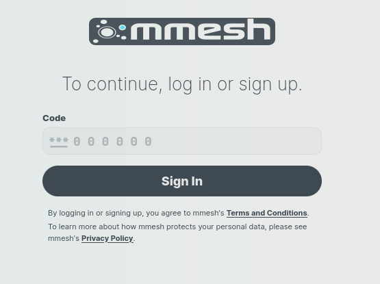

# Manage Accounts

## Create a new account

1. To sign up you just need an **email account**. Please navigate to our sign-up page at: [https://mmesh.io/signin](https://mmesh.io/signin) and insert your email address.

    
  
2. Push the `Continue with Email` button and you will get a confirmation message:

    

3. Press the `Continue` button and open your email to get your one-time code similar to this:

    

    !!! Warning

        If you can not find it in your inbox, check either the Social tab or the spam folder, just in case.
    
4. Insert your code and press `Sign In` to continue with the sign in process:

    

5. Then you will automatically be redirected back into **mmesh** and can continue with your account setup process.

    

    Please, provide the required information in the following sections:

    - **Billing Information**
    - **Account Configuration**
        - For `Control Plane Location` field, we suggest picking up a zone from the list that is geographically near to your network devices.
        - For `Connectivity Zone` field, the same suggestion made for `Control Plane Location` apply.
    - **Admin credentials**
    - **Initial Topology**
        - An initial or default network and subnet will be also created, so just provide the CIDR for your `default network` and define the first `subnet` of your election or just accept the defaults provided.

6. Finally, push the `start` button and you will be logged into the **mmesh** dashboard.

    

!!! success

    **Your account setup is complete!** Enjoy your **{++free plan++}** that allows you to have the first `tenant`, `network`, `subnet` and three first `nodes` **{++free forever**++}.

