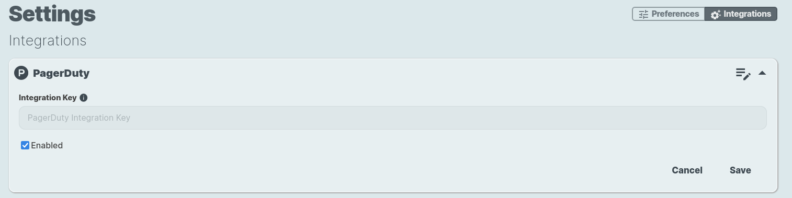
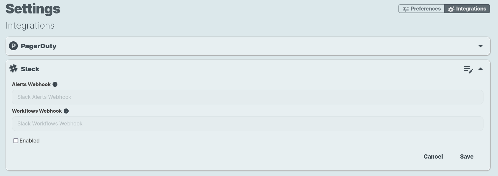

# Account Settings

## Preferences

## Integrations

### GitOps

#### GitHub

The GitHub integration allows you to implement GitOps flows and automate the configuration of your mmesh infrastructure.

You will be able to keep your automation workflows and network policies YAML files well organized in your private GitHub repositories and automatically configure your mmesh policies and workflows, or trigger custom actions on your nodes when git-push events are detected.

### Alerts

#### PagerDuty

The PagerDuty integration allows forwarding all the alerts of your mmesh to your PagerDuty account.

To configure it, on the **Account Setup** screen, select `Settings`and `Integrations`. Open the `PagerDuty` section.

Add your PagerDuty integration key, enable it, and press `Save`. Your PagerDuty integration is complete.

### Notifications

#### Slack

The Slack integration allows receiving general notifications, automation reports and alerts on the channels of your choice in your Slack organization.

mmesh will use **two different channels**: one for **general notifications and automation reports** and the other for **alerts and high-priority notifications**.

##### Configuration

First, create the [Incoming Webhooks](https://api.slack.com/messaging/webhooks) for the two channels in your Slack organization.

Next, using the webUI, select `Account > Settings > Integrations`. Open the `Slack`section:

Add your Slack Alerts and Workflows webhooks, enable it, and press `Save`. Your Slack integration is complete.
