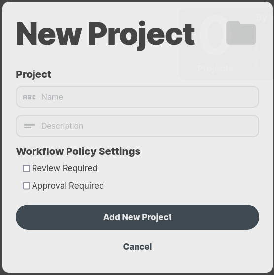
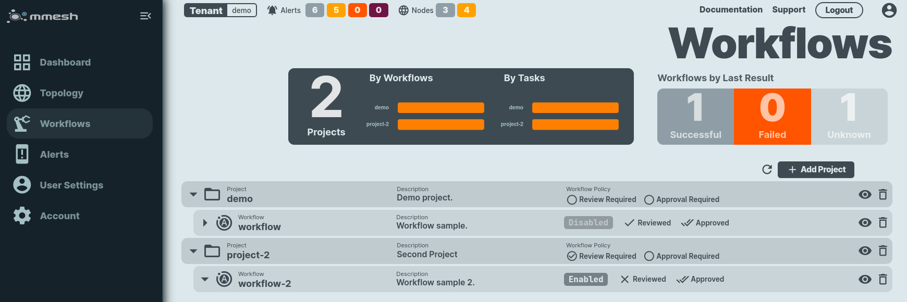
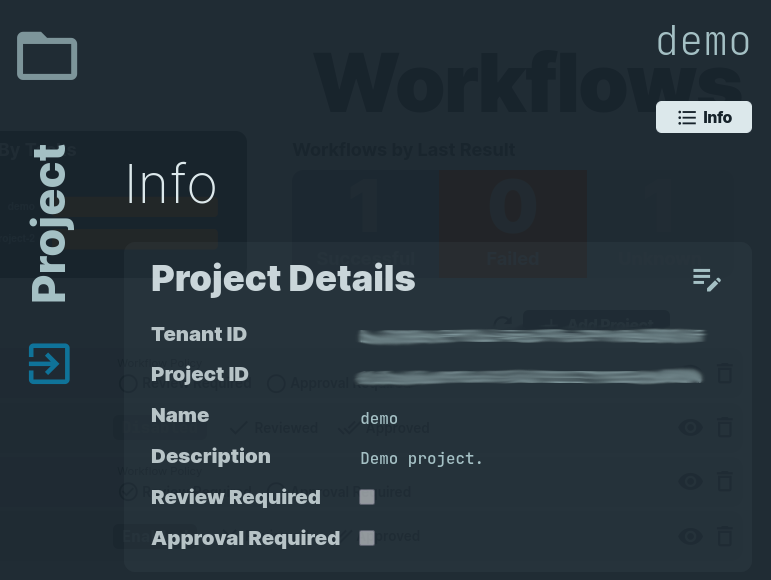
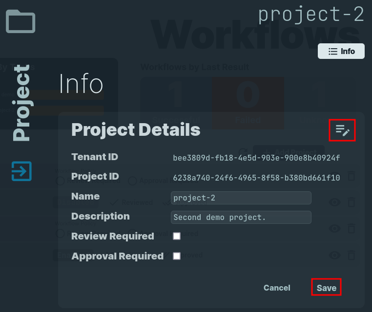
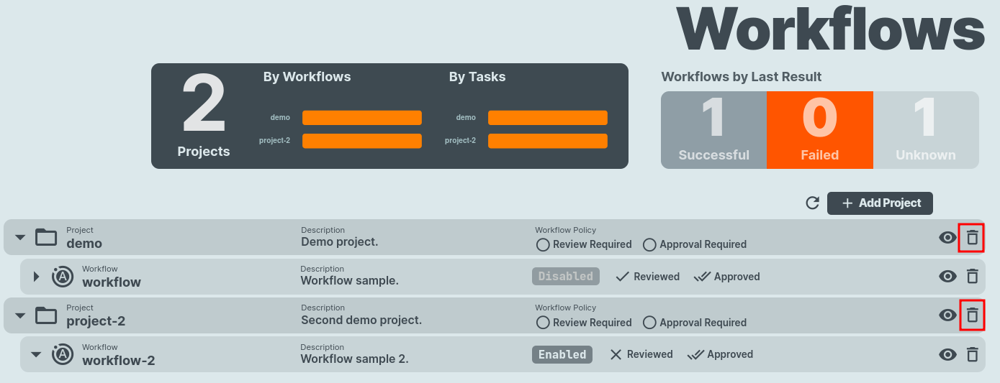

# Projects Administration

A `project` organizes `workflows` in a logical group. A `workflow` is a set of tasks that are executed on a node.

A `project` allows to define common policies to be enforced for all the `workflows` belonging to the project.

Projects can be [created](adm-projects.md#create-project), [listed](adm-projects.md#list-projects), [shown](adm-projects.md#show-project) their details, [updated](adm-projects.md#update-project) or [deleted](adm-projects.md#delete-project).


## Service Management Features

Currently the options you can configure on a project are the following:

- `Review Required`: [ yes | no ]

  Allows to enforce peer-reviews on a workflow before it can run on the target nodes.

- `Approval Required`: [ yes | no ]

  It allows for a service management policy to enforce approval before a workflow is scheduled on a node. The approval can be provided by a customer or service responsible, 
  before workflows can run.

## Operations

### Create Project

You can create a project using mmesh [webUI](https://mmesh.io/app/workflows) or [mmeshctl](mmeshctl-automation.md) CLI.

/// tab | webUI
    select: true

Go to the Workflows section on the [mmesh.io](https://mmesh.io/app/workflows) application and select `Add project`.



Provide a name and a description for your project and press `Add new project`. Select `Review Required`, `Approval Required`, or both, if required by your organization service management policy.

///

/// tab | CLI

To create a project, use the [mmeshctl](cli-install.md) CLI command:

```bash
mmeshctl ops project create
```

Provide a name and a description, and select whether reviewal or approval is required.

Example:

```bash
$ mmeshctl ops project create
mmeshctl v0.10.3-20240221030001+cdd3c9c--go1.22.0
  ■   ▄  ▄▄ ▄▄ ▄▄ ▄▄ ▄▄▄▄ ▄▄▄▄ ▄  ▄ │
■  ██    █ ▄ █ █ ▄ █ █■   ▀  ▄ █▄▄█ │ Main Website:  https://mmesh.io
  ▀   ■  ▀ ▀ ▀ ▀ ▀ ▀ ▀▀▀▀ ▀▀▀▀ ▀  ▀ │ Documentation: https://mmesh.io/docs

» Tenant: [demo] Demo tenant
» Name: demo
» Description: Demo Project.
» Enable workflow-required reviews? No
» Enable workflow-required approvals? No
                                                  ───── Ops: Project Details ≡
═══════════════════
Project Information
═══════════════════

Tenant ID  	<Tenant_ID_removed>	
Project ID 	<Project_ID_removed>	
Name       	demo                                	
Description	Demo Project.                       	

ChatOps and Service Management Features
───────────────────────────────────────

Review Required  	[no]	
Approval Required	[no]
```

///

!!! note "Keep the Tenant and Project IDs."
    Take note of the TenantID and the ProjectID as both will be required to define the workflows.


### List Projects

You can list your project using mmesh [webUI](https://mmesh.io/app/workflows) or [mmeshctl](mmeshctl-automation.md) CLI.


/// tab | webUI
    select: true

Go to the Workflows section on the [mmesh.io](https://mmesh.io/app/workflows) application to check your `Projects`.

Example: 



///

/// tab | CLI

To list your projects, use the [mmeshctl](cli-install.md) CLI command:

```bash
mmeshctl ops project list
```

Example:

```bash
$ mmeshctl ops project list
mmeshctl v0.10.3-20240221030001+cdd3c9c--go1.22.0
  ■   ▄  ▄▄ ▄▄ ▄▄ ▄▄ ▄▄▄▄ ▄▄▄▄ ▄  ▄ │
■  ██    █ ▄ █ █ ▄ █ █■   ▀  ▄ █▄▄█ │ Main Website:  https://mmesh.io
  ▀   ■  ▀ ▀ ▀ ▀ ▀ ▀ ▀▀▀▀ ▀▀▀▀ ▀  ▀ │ Documentation: https://mmesh.io/docs

» Tenant: [demo] Demo tenant
                                                         ───── Ops: Projects ≡
════════════
Project List
════════════

PROJECT NAME            	DESCRIPTION                              
----------------------------------------------------------------------
project-2               	Second Project                          	
demo                    	Demo project.                           	

```

///


### Show Project

You can show your project details using mmesh [webUI](https://mmesh.io/app/workflows) or [mmeshctl](mmeshctl-automation.md) CLI.


/// tab | webUI
    select: true

Go to the Workflows section on the [mmesh.io](https://mmesh.io/app/workflows) and select a `project` to show its details.

Example:



///

/// tab | CLI

To show details for a project, use the [mmeshctl](cli-install.md) CLI command:

```bash
mmeshctl ops project show
```

Example:

```bash
$ mmeshctl ops project show
mmeshctl v0.10.3-20240221030001+cdd3c9c--go1.22.0
  ■   ▄  ▄▄ ▄▄ ▄▄ ▄▄ ▄▄▄▄ ▄▄▄▄ ▄  ▄ │
■  ██    █ ▄ █ █ ▄ █ █■   ▀  ▄ █▄▄█ │ Main Website:  https://mmesh.io
  ▀   ■  ▀ ▀ ▀ ▀ ▀ ▀ ▀▀▀▀ ▀▀▀▀ ▀  ▀ │ Documentation: https://mmesh.io/docs

» Tenant: [demo] Demo tenant
» Project: demo
                                                  ───── Ops: Project Details ≡
═══════════════════
Project Information
═══════════════════

Tenant ID  	<Tenant_ID_removed>	
Project ID 	<Project_ID_removed>	
Name       	demo                                	
Description	Demo project.                       	

ChatOps and Service Management Features
───────────────────────────────────────

Review Required  	[no]	
Approval Required	[no]	

```

///

### Update Project

Update a project to modify its `name`, `description`, and `review` or `approval` requirements.

You can show your project details using mmesh [webUI](https://mmesh.io/app/workflows) or [mmeshctl](mmeshctl-automation.md) CLI.

/// tab | webUI
    select: true

Go to the Workflows section on the [mmesh.io](https://mmesh.io/app/workflows) and select a `project` to show its details. Then press the `edit` button on the top-right, modify as required, and press `save`.

Example:



///

/// tab | CLI

To modify project parameters such as its `name`, `description`, and `review` or `approval` requirement, use the [mmeshctl](cli-install.md) CLI command:

```bash
mmeshctl ops project update
```

Example:

```bash
$ mmeshctl ops project update
mmeshctl v0.10.3-20240221030001+cdd3c9c--go1.22.0
  ■   ▄  ▄▄ ▄▄ ▄▄ ▄▄ ▄▄▄▄ ▄▄▄▄ ▄  ▄ │
■  ██    █ ▄ █ █ ▄ █ █■   ▀  ▄ █▄▄█ │ Main Website:  https://mmesh.io
  ▀   ■  ▀ ▀ ▀ ▀ ▀ ▀ ▀▀▀▀ ▀▀▀▀ ▀  ▀ │ Documentation: https://mmesh.io/docs

» Tenant: [demo] Demo tenant
» Project: project-2
» Name: project-2
» Description: Second demo project.
» Enable workflow-required reviews? No
» Enable workflow-required approvals? No
                                                  ───── Ops: Project Details ≡
═══════════════════
Project Information
═══════════════════

Tenant ID  	<Tenant_ID_removed>	
Project ID 	<Project_ID_removed>	
Name       	project-2                           	
Description	Second demo project.                	

ChatOps and Service Management Features
───────────────────────────────────────

Review Required  	[no]	
Approval Required	[no]	
```

///

### Delete Project

When you delete a project, all its configuration and child entities (workflows) will be deleted too.

You can delete a project using mmesh [webUI](https://mmesh.io/app/workflows) or [mmeshctl](mmeshctl-automation.md) CLI.


/// tab | webUI
    select: true

Go to the Workflows section on the [mmesh.io](https://mmesh.io/app/workflows) and select the `bin` next to the `project` that you want to remove. Confirmation is requested.

Example:




///

/// tab | CLI

To delete a project and all its child workflows, use the [mmeshctl](cli-install.md) CLI command:

```bash
mmeshctl ops project delete
```

Example:

```bash
$ mmeshctl ops project delete
mmeshctl v0.10.3-20240221030001+cdd3c9c--go1.22.0
  ■   ▄  ▄▄ ▄▄ ▄▄ ▄▄ ▄▄▄▄ ▄▄▄▄ ▄  ▄ │
■  ██    █ ▄ █ █ ▄ █ █■   ▀  ▄ █▄▄█ │ Main Website:  https://mmesh.io
  ▀   ■  ▀ ▀ ▀ ▀ ▀ ▀ ▀▀▀▀ ▀▀▀▀ ▀  ▀ │ Documentation: https://mmesh.io/docs

» Tenant: [demo] Demo tenant
» Project: project-2

» Confirm deletion? Yes

   Done

```

///
