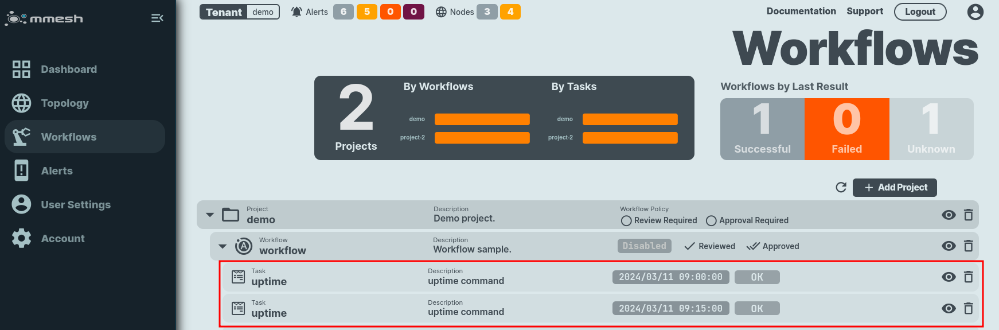
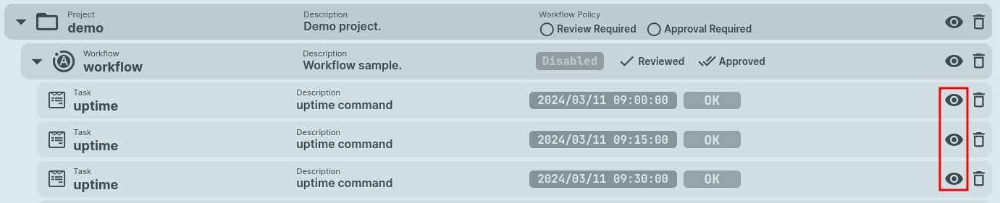
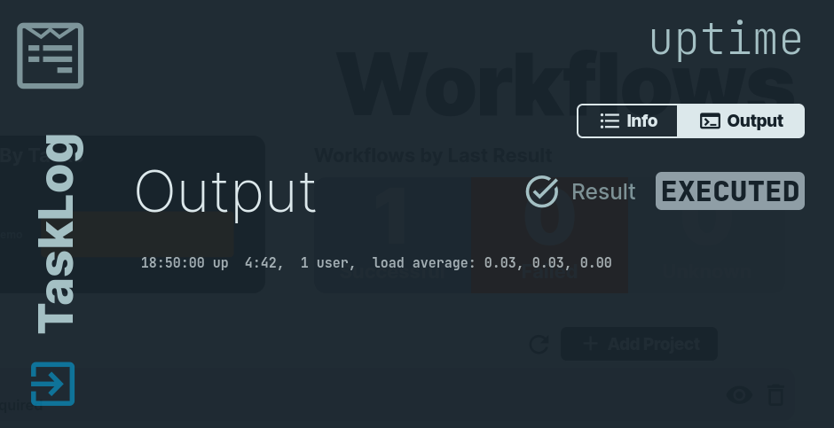
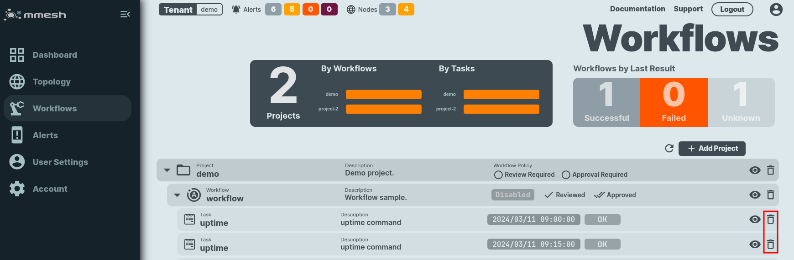

# Tasklog Administration

Each workflow execution generates an execution log. These are known as `tasklogs` in mmesh. 

Tasklogs can be [listed](adm-tasklogs.md#list-workflow-logs), [shown](adm-tasklogs.md#show-workflow-log) their details or [deleted](adm-tasklogs.md#delete-workflow-log).

## Operations

### List Workflow Logs

You can list activity logs using mmesh [webUI](https://mmesh.io/app/workflows) or [mmeshctl](mmeshctl-automation.md) CLI.

/// tab | webUI
    select: true

On the **Workflows** section on the [mmesh.io](https://mmesh.io/app/workflows) application check the task results, or tasklogs, under each workflow.

Example:



///

/// tab | CLI

To check a workflow execution log (tasklog) using CLI, execute the command:

```bash
mmeshctl ops tasklog list
```

and choose your tenant, project, and workflow.

Example:

```bash
$ mmeshctl ops tasklog list
mmeshctl v0.10.3-20240221030001+cdd3c9c--go1.22.0
  ■   ▄  ▄▄ ▄▄ ▄▄ ▄▄ ▄▄▄▄ ▄▄▄▄ ▄  ▄ │
■  ██    █ ▄ █ █ ▄ █ █■   ▀  ▄ █▄▄█ │ Main Website:  https://mmesh.io
  ▀   ■  ▀ ▀ ▀ ▀ ▀ ▀ ▀▀▀▀ ▀▀▀▀ ▀  ▀ │ Documentation: https://mmesh.io/docs

» Tenant: [demo] Demo tenant
» Project: demo
» Workflow: workflow
                                                         ───── Ops: TaskLogs ≡
════════════
TaskLog List
════════════

TASK  	TIMESTAMP          	TARGET NODE 
--------------------------------------------
uptime	2024-03-11 09:00:00	client-b   	
uptime	2024-03-11 09:30:00	client-b   	
uptime	2024-03-11 09:45:00	client-b   	
uptime	2024-03-11 10:00:00	client-b   	
uptime	2024-03-11 10:15:00	client-b   	

```

///

### Show Workflow Log

You can show a task logs using mmesh [webUI](https://mmesh.io/app/workflows) or [mmeshctl](mmeshctl-automation.md) CLI.

/// tab | webUI
    select: true

On the **Workflows** section on the [mmesh.io](https://mmesh.io/app/workflows) application, check the task results under each workflow, and open it using the `eye`on the right.

Example:



Select one of the executions and you will get all the information about it, plus the output of your task.

Example:



///

/// tab | CLI

To check a workflow execution log (tasklog) using CLI, execute the command `mmeshctl ops tasklog show` and choose your tenant, project, workflow and tasklog. 

Example:

```bash
$ mmeshctl ops tasklog show
mmeshctl v0.10.3-20240221030001+cdd3c9c--go1.22.0
  ■   ▄  ▄▄ ▄▄ ▄▄ ▄▄ ▄▄▄▄ ▄▄▄▄ ▄  ▄ │
■  ██    █ ▄ █ █ ▄ █ █■   ▀  ▄ █▄▄█ │ Main Website:  https://mmesh.io
  ▀   ■  ▀ ▀ ▀ ▀ ▀ ▀ ▀▀▀▀ ▀▀▀▀ ▀  ▀ │ Documentation: https://mmesh.io/docs

» Tenant: [demo] Demo tenant
» Project: demo
» Workflow: workflow
» TaskLog:  [Use arrows to move, type to filter]
🢂 Task: uptime | Timestamp: 2024-03-06 10:50:00.008 +0100 CET
  Target: client-b

  Task: uptime | Timestamp: 2024-03-06 10:55:00.011 +0100 CET
  Target: client-b
» TaskLog: Task: uptime | Timestamp: 2024-03-06 10:50:00.008 +0100 CET
  Target: client-b

                                                  ───── Ops: TaskLog Details ≡
═══════════════════
TaskLog Information
═══════════════════

Tenant ID               <Tenant_ID_removed>
Project ID              <Project_ID_removed>
Workflow ID             <Workflow_ID_removed>	
TaskLog ID              <Tasklog_ID_removed>
Task Name               uptime                              
Task Description        uptime command                      
Tenant                  demo                                
Node                    client-b                            
Result                  [EXECUTED]                          
Timestamp               2024-03-06 10:50:00.008 +0100 CET   

Activity Log
────────────

-----BEGIN OUTPUT-----
 10:50:00 up 22:52,  1 user,  load average: 0.72, 1.29, 1.68
-----END OUTPUT-----

```

///


### Delete Workflow Log

You can remove workflow task logs using mmesh [webUI](https://mmesh.io/app/workflows) or [mmeshctl](mmeshctl-automation.md) CLI.

/// tab | webUI
    select: true

On the **Workflows** section on the [mmesh.io](https://mmesh.io/app/workflows) application, when checking task results under each workflow, press the `bin` icon on the right. Confirmation is requested.

Example:



///

/// tab | CLI

To delete a workflow execution log (tasklog) using CLI, execute the command:

```bash
mmeshctl ops tasklog delete
```

and choose your tenant, project, workflow and tasklog.

``` bash
$ mmeshctl ops tasklog delete
mmeshctl v0.10.3-20240221030001+cdd3c9c--go1.22.0
  ■   ▄  ▄▄ ▄▄ ▄▄ ▄▄ ▄▄▄▄ ▄▄▄▄ ▄  ▄ │
■  ██    █ ▄ █ █ ▄ █ █■   ▀  ▄ █▄▄█ │ Main Website:  https://mmesh.io
  ▀   ■  ▀ ▀ ▀ ▀ ▀ ▀ ▀▀▀▀ ▀▀▀▀ ▀  ▀ │ Documentation: https://mmesh.io/docs

» Tenant: [demo] Demo tenant
» Project: demo
» Workflow: workflow
» TaskLog: Task: uptime | Timestamp: 2024-03-11 09:15:00.688 +0100 CET
  Target: client-b


» Confirm deletion? Yes

   Done

```

///
