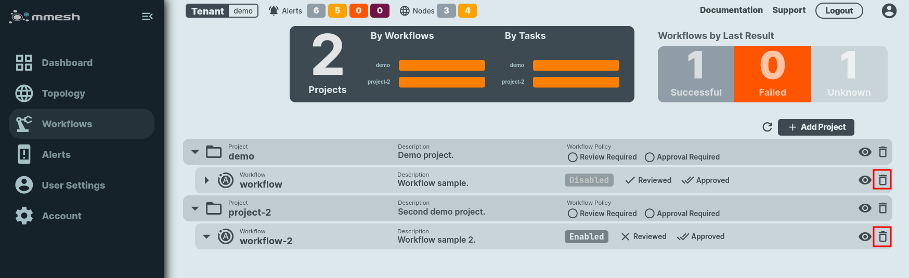

# Workflows Administration

The automation subsystem of mmesh is based on `workflows`.  A `workflow` is a set of tasks executed on a node on a defined schedule or event triggered.

Workflows are created using a declarative YAML file. On it you define the jobs, processes or tasks that you want to automate, the triggers and schedule configuration to launch them, the target node and other parameters like notification recipients and reviewers/approvers.

!!! danger "¿¿¿QUITAR???"

    You can easily manage your mmesh workflows via GitOps by enabling [GitHub integration](adm-account.md#gitops).

!!! info "Automation"

    See the [automation](automation.md) section to find more information on mmesh workflows.

Workflows are defined using a YAML [configuration](adm-workflows.md#workflow-configuration-file) file.

The operations available to manage workflows are [create or update](adm-workflows.md#create-or-update-workflow), [list](adm-workflows.md#list-workflows), [show](adm-workflows.md#show-workflow), [enable](adm-workflows.md#enable-workflow), [disable](adm-workflows.md#disable-workflow), and [delete](adm-workflows.md#delete-workflow).

## Workflow configuration file

In mmesh you configure automation `workflows` by applying a configuration from a YAML file.

The basic content for a simple `workflow` configuration file that you can adapt to your needs is shown below:

```yaml
# mmesh workflow
apiVersion: v1
kind: Workflow

projectID: <Replace with your ProjectID>

name: workflow
description: Workflow sample.

enabled: true

triggers:
  schedule:
    enabled: true
    crontab: "0,5,10,15,20,25,30,35,40,45,50,55 * * * *" # min hour dayOfMonth month dayOfWeek

tasks:
  - name: uptime
    description: uptime command
    command:
      cmd: /usr/bin/uptime

targets:
  - tenantID: <Replace with your TenantID>
    nodeID: <Replace with your NodeID>
```

!!! info "Replace with your data."

    Replace on the workflow YAML file the **TenantID**, **ProjectID** and **NodeID** with your own data where stated.


!!! note "Modify to your requirements."

    The previous example will execute the command `uptime` every 5 minutes. Modify it to your needs changing the command and the schedule as required.


For the rest of configuration parameters, check the [Workflow Configuration Reference](workflow.yml.md) section with full details on the workflows YAML file format.

## Create or Update Workflow

To create a workflow, you need to configure its using a YAML [configuration](adm-workflows.md#workflow-configuration-file) file. 

At the moment, workflows can only be defined using the mmeshctl CLI, with the command:

```shell
mmeshctl ops workflow create -f <yamlFile>
```

Example:

```bash
# mmeshctl ops workflow create -f workflow.yml
mmeshctl v0.10.3-20240221030001+cdd3c9c--go1.22.0
  ■   ▄  ▄▄ ▄▄ ▄▄ ▄▄ ▄▄▄▄ ▄▄▄▄ ▄  ▄ │
■  ██    █ ▄ █ █ ▄ █ █■   ▀  ▄ █▄▄█ │ Main Website:  https://mmesh.io
  ▀   ■  ▀ ▀ ▀ ▀ ▀ ▀ ▀▀▀▀ ▀▀▀▀ ▀  ▀ │ Documentation: https://mmesh.io/docs

» Tenant: [demo] Demo tenant
» Project: demo
                                                 ───── Ops: Workflow Details ≡
════════════════════
Workflow Information
════════════════════

Tenant ID  	<Tenant_ID_removed>	
Project ID 	<Project_ID_removed>	
Workflow ID	<Workflow_ID_removed>	
Name       	workflow                            	
Description	Workflow sample.                    	
Enabled    	[yes]                               	
Reviewed   	[yes]                               	
Approved   	[yes]                               	

Triggers
────────

Workflow Webhook	[disabled]	

Workflow Crontab	[enabled]	0,5,10,15,20,25,30,35,40,45,50,55 * * * *	

Tasks
─────

Task Name	Command        	Args	UID	GID	
---------	-------        	----	---	---	
uptime   	/usr/bin/uptime	    	0  	0  	

Targets
───────

Tenant	Node                            	
------	----                            	
demo  	client-b                        	

Activity
────────

Successful Events  	0000000                      	
Failed Events      	0000000                      	
First Activity     	1970-01-01 01:00:00 +0100 CET	
Last Activity      	1970-01-01 01:00:00 +0100 CET	
Activity Index     	0.0000                       	
Failure Probability	0.00%                        	
Score              	0.00                         	
Resource Rating    	[n/a]  
```

!!! note "Keep the Project ID."

    Take note of the provided workflow ID, as it is required if you want to modify the created workflow. For this, add the workflow ID just below the Project ID on the `workflow.yml` file:

    ```yaml
    projectID: <Replace with your ProjectID>
    workflowID: <Replace with your WorkflowID>
    ```

In a few minutes this workflow will be executed and we will be able to [list](adm-tasklogs.md#list-workflow-logs) the executions or to [show](adm-tasklogs.md#show-workflow-log) the log.

To update a project, you need to add its `workflowID` to it and execute the update command:

```shell
mmeshctl ops workflow update -f <yamlFile>
```

Example:

```bash
# mmeshctl ops workflow update -f workflow.yml 
mmeshctl v0.10.3-20240221030001+cdd3c9c--go1.22.0
  ■   ▄  ▄▄ ▄▄ ▄▄ ▄▄ ▄▄▄▄ ▄▄▄▄ ▄  ▄ │
■  ██    █ ▄ █ █ ▄ █ █■   ▀  ▄ █▄▄█ │ Main Website:  https://mmesh.io
  ▀   ■  ▀ ▀ ▀ ▀ ▀ ▀ ▀▀▀▀ ▀▀▀▀ ▀  ▀ │ Documentation: https://mmesh.io/docs

» Tenant: [demo] Demo tenant
» Project: demo
» Workflow: workflow
                                                 ───── Ops: Workflow Details ≡
════════════════════
Workflow Information
════════════════════

Tenant ID  	<Tenant_ID_removed>	
Project ID 	<Project_ID_removed>	
Workflow ID	<Workflow_ID_removed>	
Name       	workflow                            	
Description	Workflow sample.                    	
Enabled    	[no]                                	
Reviewed   	[yes]                               	
Approved   	[yes]                               	

Triggers
────────

Workflow Webhook	[disabled]	

Workflow Crontab	[enabled]	0,5,10,15,20,25,30,35,40,45,50,55 * * * *	

Tasks
─────

Task Name	Command        	Args	UID	GID	
---------	-------        	----	---	---	
uptime   	/usr/bin/uptime	    	0  	0  	

Targets
───────

Tenant	Node                            	
------	----                            	
demo  	client-b                        	

Activity
────────

Successful Events  	0000006                          	
Failed Events      	0000000                          	
First Activity     	2024-03-01 17:00:01.388 +0100 CET	
Last Activity      	2024-03-01 17:25:01.338 +0100 CET	
Activity Index     	0.0040                           	
Failure Probability	0.00%                            	
Score              	6.00                             	
Resource Rating    	[A]                              	
Last Event Result  	[SUCCESS]                        	

```

## List Workflows

List all your workflows.

```shell
mmeshctl ops workflow list
```

## Show Workflow

To show all the details of a workflow, execute the CLI command:

```shell
mmeshctl ops workflow show
```

Example:

```bash
# mmeshctl ops workflow show
mmeshctl v0.10.3-20240221030001+cdd3c9c--go1.22.0
  ■   ▄  ▄▄ ▄▄ ▄▄ ▄▄ ▄▄▄▄ ▄▄▄▄ ▄  ▄ │
■  ██    █ ▄ █ █ ▄ █ █■   ▀  ▄ █▄▄█ │ Main Website:  https://mmesh.io
  ▀   ■  ▀ ▀ ▀ ▀ ▀ ▀ ▀▀▀▀ ▀▀▀▀ ▀  ▀ │ Documentation: https://mmesh.io/docs

» Tenant: [demo] Demo tenant
» Project: demo
» Workflow: workflow
                                                 ───── Ops: Workflow Details ≡
════════════════════
Workflow Information
════════════════════

Tenant ID  	<Tenant_ID_removed>	
Project ID 	<Project_ID_removed>	
Workflow ID	<Workflow_ID_removed>	
Name       	workflow                            	
Description	Workflow sample.                    	
Enabled    	[yes]                               	
Reviewed   	[yes]                               	
Approved   	[yes]                               	

Triggers
────────

Workflow Webhook	[disabled]	

Workflow Crontab	[enabled]	0,5,10,15,20,25,30,35,40,45,50,55 * * * *	

Tasks
─────

Task Name	Command        	Args	UID	GID	
---------	-------        	----	---	---	
uptime   	/usr/bin/uptime	    	0  	0  	

Targets
───────

Tenant	Node                            	
------	----                            	
demo  	client-b                        	

Activity
────────

Successful Events  	0000006                          	
Failed Events      	0000000                          	
First Activity     	2024-03-01 17:00:01.388 +0100 CET	
Last Activity      	2024-03-01 17:25:01.338 +0100 CET	
Activity Index     	0.0040                           	
Failure Probability	0.00%                            	
Score              	6.00                             	
Resource Rating    	[A]                              	
Last Event Result  	[SUCCESS]                        	

```

## Enable Workflow

To enable a previously disabled workflow, execute the CLI command:

```shell
mmeshctl ops workflow enable
```

And select the workflow to enable by choosing the `tenant`, `project` and `workflow`.

Example:

```bash
# mmeshctl ops workflow enable
mmeshctl v0.10.3-20240221030001+cdd3c9c--go1.22.0
  ■   ▄  ▄▄ ▄▄ ▄▄ ▄▄ ▄▄▄▄ ▄▄▄▄ ▄  ▄ │
■  ██    █ ▄ █ █ ▄ █ █■   ▀  ▄ █▄▄█ │ Main Website:  https://mmesh.io
  ▀   ■  ▀ ▀ ▀ ▀ ▀ ▀ ▀▀▀▀ ▀▀▀▀ ▀  ▀ │ Documentation: https://mmesh.io/docs

» Tenant: [demo] Demo tenant
» Project: demo
» Workflow: workflow
                                                 ───── Ops: Workflow Details ≡
════════════════════
Workflow Information
════════════════════

Tenant ID  	<Tenant_ID_removed>	
Project ID 	<Project_ID_removed>	
Workflow ID	<Workflow_ID_removed>	
Name       	workflow                            	
Description	Workflow sample.                    	
Enabled    	[yes]                               	
Reviewed   	[yes]                               	
Approved   	[yes]                               	

Triggers
────────

Workflow Webhook	[disabled]	

Workflow Crontab	[enabled]	0,15,30,45 * * * *	

Tasks
─────

Task Name	Command        	Args	UID	GID	
---------	-------        	----	---	---	
uptime   	/usr/bin/uptime	    	0  	0  	

Targets
───────

Tenant	Node                            	
------	----                            	
demo  	client-b                        	

Activity
────────

Successful Events  	0000092                          	
Failed Events      	0000000                          	
First Activity     	2024-03-06 10:50:01.365 +0100 CET	
Last Activity      	2024-03-11 10:15:01.308 +0100 CET	
Activity Index     	0.0002                           	
Failure Probability	0.00%                            	
Score              	92.00                            	
Resource Rating    	[A]                              	
Last Event Result  	[SUCCESS]                        	

```

## Disable Workflow

To disable a previously enabled workflow, execute the CLI command:

```shell
mmeshctl workflow disable
```

And select the workflow to disable by choosing the `tenant`, `project` and `workflow`.

*Disabled* workflows are inactive.

Example:

```bash
# mmeshctl ops workflow disable
mmeshctl v0.10.3-20240221030001+cdd3c9c--go1.22.0
  ■   ▄  ▄▄ ▄▄ ▄▄ ▄▄ ▄▄▄▄ ▄▄▄▄ ▄  ▄ │
■  ██    █ ▄ █ █ ▄ █ █■   ▀  ▄ █▄▄█ │ Main Website:  https://mmesh.io
  ▀   ■  ▀ ▀ ▀ ▀ ▀ ▀ ▀▀▀▀ ▀▀▀▀ ▀  ▀ │ Documentation: https://mmesh.io/docs

» Tenant: [demo] Demo tenant
» Project: demo
» Workflow: workflow
                                                 ───── Ops: Workflow Details ≡
════════════════════
Workflow Information
════════════════════

Tenant ID  	<Tenant_ID_removed>	
Project ID 	<Project_ID_removed>	
Workflow ID	<Workflow_ID_removed>	
Name       	workflow                            	
Description	Workflow sample.                    	
Enabled    	[no]                                	
Reviewed   	[yes]                               	
Approved   	[yes]                               	

Triggers
────────

Workflow Webhook	[disabled]	

Workflow Crontab	[enabled]	0,15,30,45 * * * *	

Tasks
─────

Task Name	Command        	Args	UID	GID	
---------	-------        	----	---	---	
uptime   	/usr/bin/uptime	    	0  	0  	

Targets
───────

Tenant	Node                            	
------	----                            	
demo  	client-b                        	

Activity
────────

Successful Events  	0000092                          	
Failed Events      	0000000                          	
First Activity     	2024-03-06 10:50:01.365 +0100 CET	
Last Activity      	2024-03-11 10:15:01.308 +0100 CET	
Activity Index     	0.0002                           	
Failure Probability	0.00%                            	
Score              	92.00                            	
Resource Rating    	[A]                              	
Last Event Result  	[SUCCESS]                        	

```

## Delete Workflow

A workflow can be deleted using the webUI or the CLI.

/// tab | webUI
    select: true

Go to the Workflows section on the [mmesh.io](https://mmesh.io/app/workflows) application and press on the `bin` icon on the workload that you want to delete. All of its tasks logs will be removed too. Confirmation is required. 




///

/// tab | CLI

To delete a workflow, use the command:

```shell
mmeshctl ops workflow delete
```

And select the workflow to delete by choosing the `tenant`, `project` and `workflow`.

Example: 

```bash
# mmeshctl ops workflow delete
mmeshctl v0.10.3-20240221030001+cdd3c9c--go1.22.0
  ■   ▄  ▄▄ ▄▄ ▄▄ ▄▄ ▄▄▄▄ ▄▄▄▄ ▄  ▄ │
■  ██    █ ▄ █ █ ▄ █ █■   ▀  ▄ █▄▄█ │ Main Website:  https://mmesh.io
  ▀   ■  ▀ ▀ ▀ ▀ ▀ ▀ ▀▀▀▀ ▀▀▀▀ ▀  ▀ │ Documentation: https://mmesh.io/docs

» Tenant: [demo] Demo tenant
» Project: demo
» Workflow: workflow

» Confirm deletion? Yes

   Done

```

///

