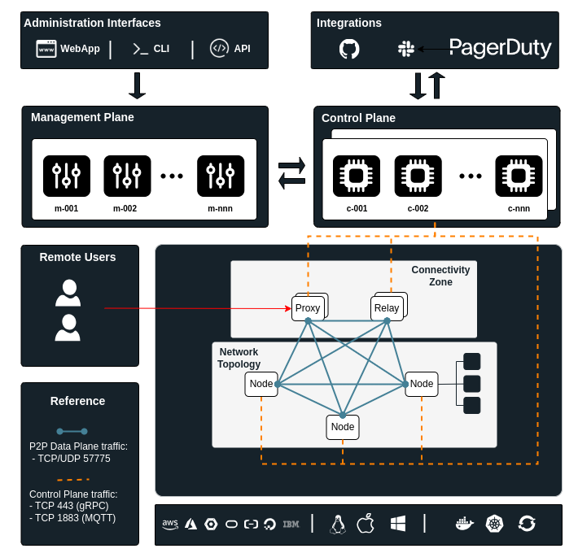
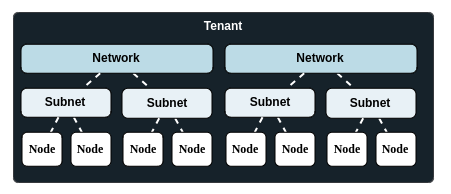

## Design Principles

mmesh is an all-in-one, hybrid cloud integration platform designed to be **simple**, **scalable**, **secure** and **easy-to-use**.

You won't need to be an expert network or systems engineer to take full advantage of mmesh.

mmesh can be an excellent choice for everyone who is moving to the cloud and looks for an easy-to-use but feature-rich, multi-cloud integration platform to reduce complexity and costs.

mmesh allows you to simplify your infrastructure deployments and get rid of complex network integrations.

# Architecture

The **mmesh** MCN platform logically split into differents planes.

- **Data Plane:** the network paths that transport data (in the form of packets) from source to destination.
- **Control Plane:** protocols and logic that change how packets are steered across the data plane.
- **Management Plane:** the configuration and monitoring interfaces for the data plane and control plane.

## Components

### Managers

### Controllers 

Controllers are integral components within the architecture tasked with programming mmesh nodes, proxies, and relays. Their responsibility lies in enabling these components to execute the functions defined by the user.
Controllers are regionally scoped, horizontally scalable components that function similarly to BGP route reflectors in traditional networks. However, in this case, they utilize gRPC and MQTT to accomplish the same task.
Upon creating an account, you have the option to select the region of mmesh controllers that best aligns with your requirements.

### Connectivity Zones

Connectivity zones are components that allow hosting other elements such as relays and proxies. They are an internal part of the platform and are associated with mmesh networks. The services deployed in connectivity zones may generate delays between nodes and users, as well as among mmesh nodes themselves. Therefore, it is recommended to select the region of the connectivity zone closest to the location or region where mmesh nodes of a network are planned to be deployed.

### Tenant

A mmesh tenant functions as a logical entity within the mmesh system, facilitating the segregation and isolation of various resources including **networks**, **Subnets**, **nodes**, **alerts**, **workflows**, and **Security Groups** within an account. Users have the capability to create an unlimited number of tenants within their mmesh account.

### Network Topology

Network Topology is an abstraction layer that you construct when deploying and interconnecting components such as **nodes**, **networks**, and **subnets** within an mmesh **tenant**. This overlay is built on top of your cloud and on-premises environments.

### Networks

A network represents a vital element within the mmesh infrastructure, serving to organize IP Subnets into logical groupings. While there is no limit to the number of networks that can be created, each network can contain up to 255 subnets.

By default, all IP subnets within a network are isolated from each other. However, this isolation can be reversed by enabling the "routed subnets" option within the network configuration.

Furthermore, networks are linked to a connectivity zone, establishing a connection to a specific area or domain within the mmesh environment. This association helps in defining the scope and reach of network connectivity within the mmesh architecture.

### Subnets

A subnet serves as a logical entity within mmesh, organizing nodes into groups. Each subnet can accommodate a maximum of 255 nodes. Configured with a /24 IPv4 prefix from the network IP range, a subnet provides the necessary addressing for connected nodes.

Furthermore, every subnet is associated with a security policy that is enforced at the node level. This distributed firewall protection ensures the security of the network by regulating traffic and access across the nodes within the subnet.

### Node

A node serves as a client within the mmesh, facilitating the connection of workloads either to a mmesh subnet (Connected-Node) or integration with the mmesh control plane (Stubby-node). This node can take various forms such as a virtual machine (VM), a Kubernetes Pod, a bare-metal server, a Docker container, a laptop, or a workstation.

Up to 255 nodes can be connected to a mmesh subnet at maximum capacity. When a node is connected to a subnet, it is assigned at least one IP address from the subnet's IP range.

### Relay

In mmesh, nodes create peer-to-peer connections, but occasionally direct communication between them is not possible. In such cases, a relay can step in to facilitate communication, enabling connections between nodes. By default, mmesh offers relay nodes within network connectivity zones. Furthermore, clients can deploy mmesh nodes and set them up as relays, granting them the ability to determine the most efficient route for their traffic.

### Proxy
### Relay

In mmesh, nodes create peer-to-peer connections, but occasionally direct communication between them is not possible. In such cases, a relay can step in to facilitate communication, enabling connections between nodes. By default, mmesh offers relay nodes within network connectivity zones. Furthermore, clients can deploy mmesh nodes and set them up as relays, granting them the ability to determine the most efficient route for their traffic.

### Proxy

Proxies within the mmesh architecture operate within network connectivity zones and facilitate services such as Identity-Aware-Proxy. With Identity-Aware-Proxy, you can establish a centralized authorization layer for applications accessed via HTTPS from the internet, without requiring any client or agent on the user side. This enables the utilization of an application-level access control model, bypassing the need for reliance on network-level firewalls.
Proxies within the mmesh architecture operate within network connectivity zones and facilitate services such as Identity-Aware-Proxy. With Identity-Aware-Proxy, you can establish a centralized authorization layer for applications accessed via HTTPS from the internet, without requiring any client or agent on the user side. This enables the utilization of an application-level access control model, bypassing the need for reliance on network-level firewalls.