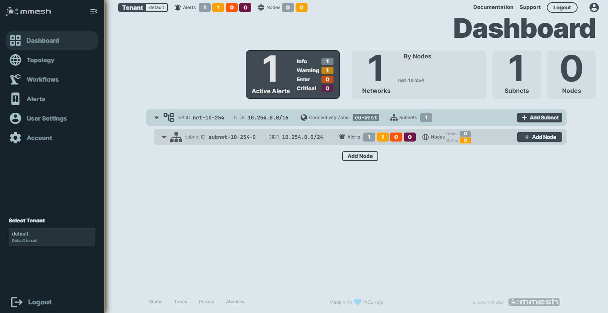
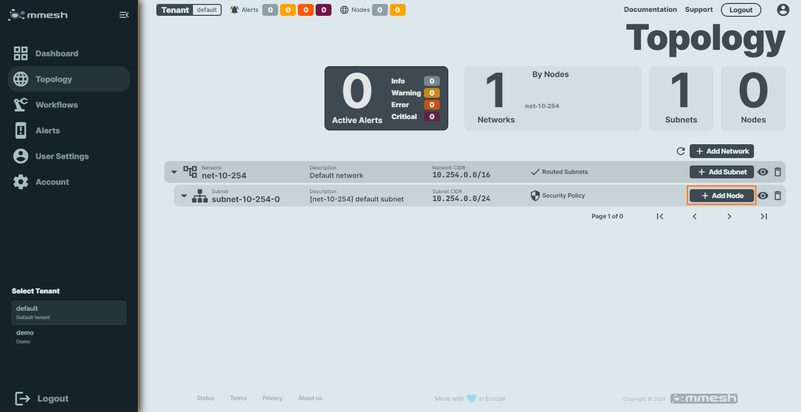
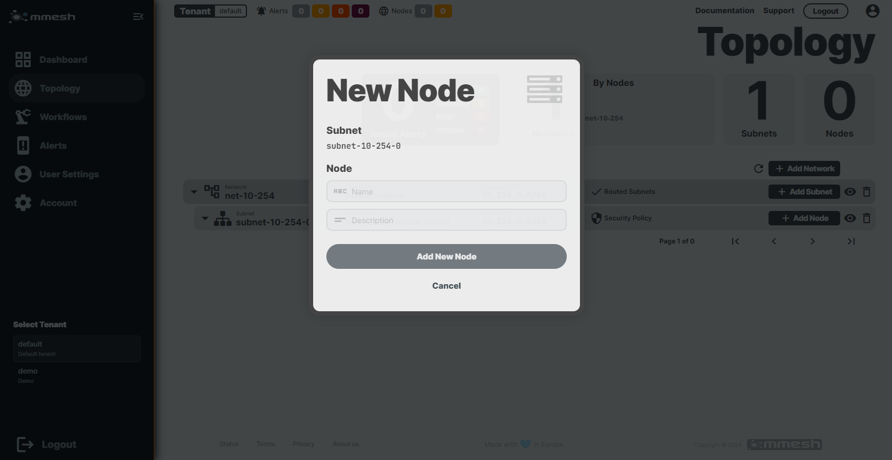
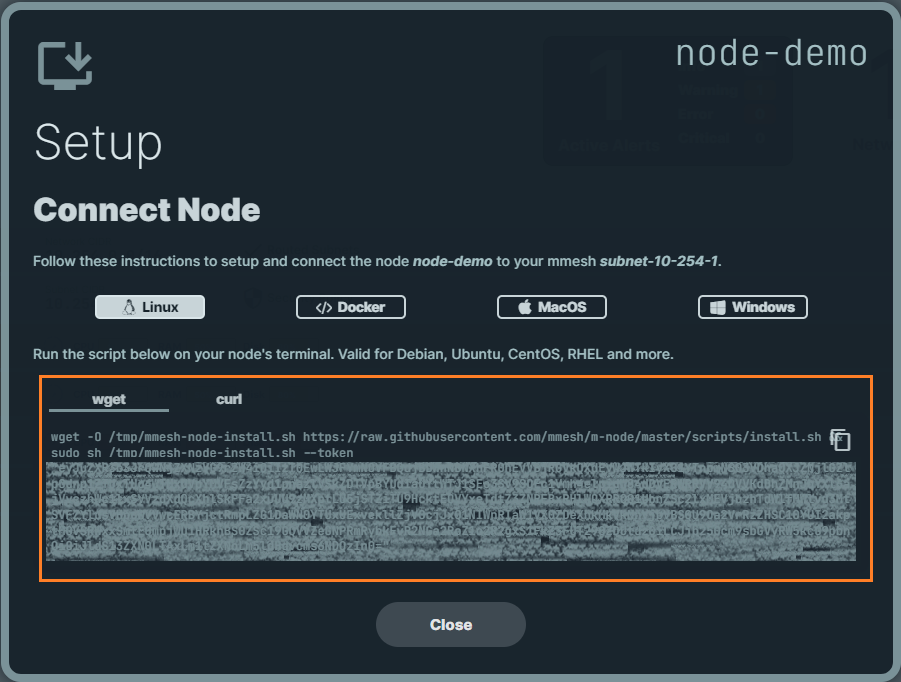

# Quick Start

mmesh is an innovative overlay network build for the cloud. It lets you easily create your virtual network to integrate your on-prem and multi-cloud environments in minutes.

Get started with the following steps to create your own virtual private network:

## 1. Create your account

Follow these [instructions](account.md#create-a-new-account) to create your account.

After a sucesssful login, you will be redirected to the `Dashboard` screen. Here you can see that a default [network](topology.md#network) and [subnet](topology.md#subnet) were automatically created in the `default` [tenant](topology.md#tenant) with the information provided in the account setup.

## 2. Add a node to your subnet

Any servers, laptops, containers or cloud VMs from different providers can be added as [node](nodes.md). 

From the webUI on `Topology` section, select the `default` subnet and click on the `Add Node` button.

Fill the `Name` and `Description` in the `New Node` pop-up window and click on the `Add New Node`.

!!! Note

    See [Nodes Administration](adm-nodes.md) section for more information.

## 3. Install mmesh-node agent

The **mmesh-node** agent is an open-source app that runs on the machines you want to connect to your mmesh virtual private network.

**mmesh-node** is available for a variety of Linux platforms, macOS and Windows.

The easiest way to install the **mmesh-node** agent in seconds is using the one-line command provided in the previous step:

!!! Note

    See [Node Installation](nodes-install.md) section to find more information how to install `mmesh-node` agent.

## 4. Add more nodes to your subnet

We can really appreciate the true power of **mmesh** when it’s installed on multiple devices. Add more nodes to your subnet by repeating steps 2 and 3.

!!! success 

    Congratulations! You just created your own your virtual network with **mmesh**.

## What's next?

By completing this guide you have your mmesh up and running and are ready to explore the features of mmesh:

- [Install mmeshctl](cli-install.md), our mmesh command line interface.
- Integrate your Kubernetes [services](k8s-services.md) and [workloads](k8s-pods.md).
- Manage your traffic with [security polices](network-security.md#security-policies).
- Manage your automation with [workflows](automation.md).
- And [more](../features/index.md)

## Need some inspirations?

Check our [how-to guides](../howtos/index.md):

- [Secure a Windows RDP (Remote Desktop Protocol) Server](secure-win-rdp.md)

