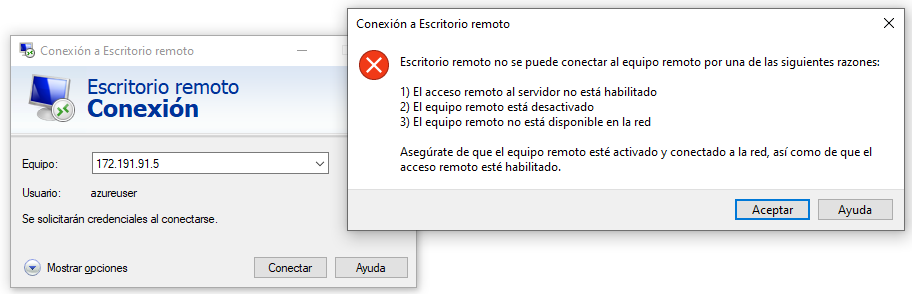

# Secure a Windows RDP (Remote Desktop Protocol) Server

**Remote Desktop Protocol** (RDP) allows users to remotely control and interact with a computer as if they were physically present at the machine. This can be useful for various purposes, including technical support, troubleshooting, and accessing resources on a remote machine.

Remote Desktop Protocol (RDP) has been a common target for cyber attackers, including those deploying ransomware. The widespread use of RDP for legitimate remote access also makes it an attractive target for malicious actors looking to gain unauthorized access to systems. 

One way to greatly reduce your attack surface is to avoid exposing your RDP to the Internet.

With mmesh, you can allow only clients on your mmesh virtual private network to connect to your RDP servers. Mmesh works transparently with the RDP client, securing your network without making RDP any harder to use.

Here is the high-level overview of the guide setup architecture:

## Before you begin

- This guide requires you to be on a Windows system that can serve as a Remote Desktop Server. 

    !!! Note
        If you do not have a remote Windows system, you can use [Quickstart: Use Terraform to create a Windows VM](https://learn.microsoft.com/en-us/azure/virtual-machines/windows/quick-create-terraform) in Azure.

- A [mmesh account](https://mmesh.io/login) created and one subnet with `10.254.1.0/24` prefix.

## Step-by-step Guide

### Step 1: Connect Client Device to our mmesh virtual private network

We need to connect `Client Device` to our mmesh virtual private network to allow the connection to `Azure VM` privately. 

To connect a new node in a subnet with mmesh is very easy, from `Topology` section, we only need to select `Add Node` in the subnet and set a name and description:

Here, we can select the environment where we are going to install the `mmesh-node` agent. In this case, we are going to use Windows:

Open a `Windows PowerShell` as Administrator in `Client Device` and execute the previous one-line command:

You can use `ipconfig` command on `Client Device` to check the IP assigned to this node:

### Step 2: Connect `Azure VM` to our mmesh virtual private network

Now, we need to connect `Azure VM` to our mmesh virtual private network to allow the connection from `Client Device` privately. 

We are going to repeat the same steps, from `Topology` section, select `Add Node` in the subnet and set a name and description:

Here, we can select the environment where we are going to install the `mmesh-node` agent. In this case, we are going to use Windows:

So we are going to connect to `Azure VM` via RDP through the public IP address, since we have not yet established mmesh virtual private network: 

Open a `Windows PowerShell` as Administrator in `Azure VM` and execute the previous one-line command:

You can use `ipconfig` command on `Azure VM` to check the IP assigned to this node:

### Step 3: Remove RDP access from the Internet

To remove RDP access the from Internet in the `Azure VM`, we are going to `Select your VM > Networking > Network settings > Network security group` and then remove RDP inbound port rules:

If we try to connect to `Azure VM` via RDP through the public IP, we will have the following error:

### Step 4: Verify we can connect to `Azure VM` via RDP through our mmesh virtual private network

And we’re done! Now we can verify that we can connect to `Azure VM` via RDP from `Client Device` through our mmesh virtual private network. So we are going to connect to `Azure VM` via RDP through the `10.254.1.236` IP address assigned by mmesh IPAM:

At this point, any node on your mmesh network should be able to access `Azure VM`. To control access within your mmesh virtual private network, you should use [Security Policies](network-security.md#security-policies).

## Conclusion

In this guide, we've learned how [mmesh](https://mmesh.io) can help to avoid exposing RDP to the Internet. So organizations can significantly reduce the risk of RDP-related security incidents and protect their systems from ransomware attacks and other forms of exploitation.
