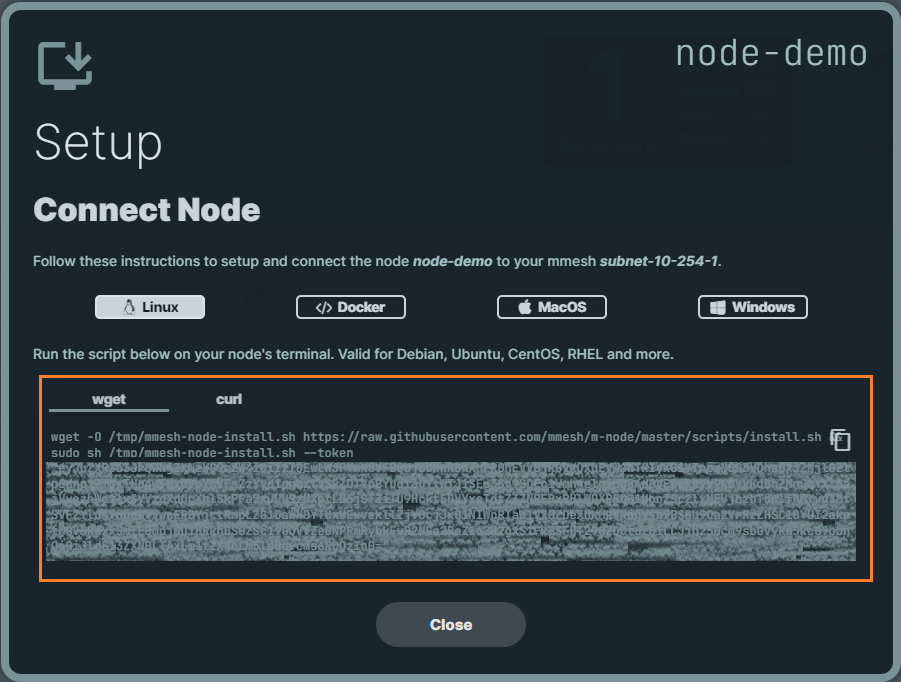
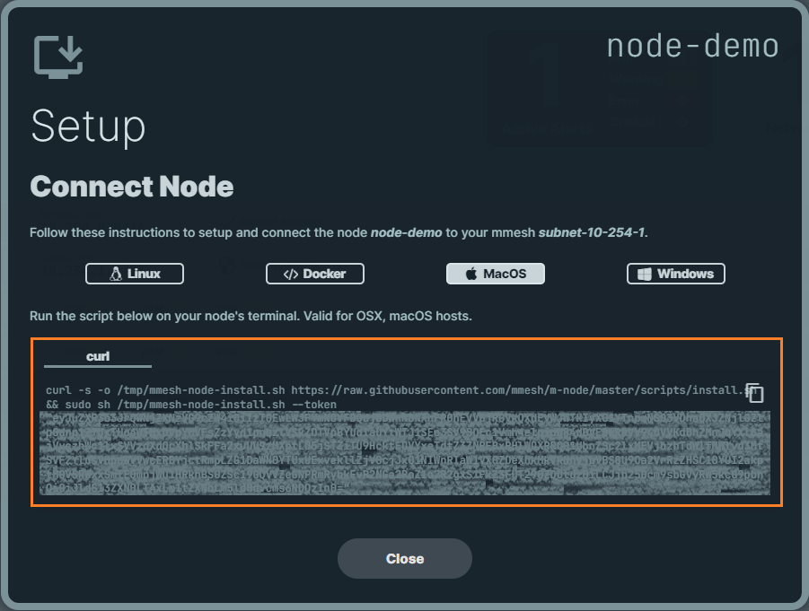

# Nodes Installation

The `mmesh-node` agent is an open-source app that runs on the machines you want to connect to your [mmesh](https://mmesh.io/) virtual private network.

`mmesh-node` is available for a variety of Linux platforms, macOS and Windows.

Check out its [GitHub repository](https://github.com/mmesh/m-node) for more details and information on support, contributing, etc.

## Minimum Requirements

`mmesh-node` has the same [minimum requirements](https://github.com/golang/go/wiki/MinimumRequirements#minimum-requirements) as Go:

- Linux kernel version 2.6.23 or later
- Windows 7 or later
- FreeBSD 11.2 or later
- MacOS 10.11 El Capitan or later

## Binary Downloads

Linux, macOS and Windows binary downloads are available from the [Releases](https://github.com/mmesh/m-node/releases) page at the [mmesh-node GitHub Repository](https://github.com/mmesh/m-node).

You can download the pre-compiled binaries and install them with the appropriate tools.

## Linux Installation

/// tab | Magic Link
    select: True

The easiest way to install the `mmesh-node` agent in seconds is by using the magic link that is automatically generated when you [add a new node](adm-nodes.md#add-node) in the mmesh web UI:



///

/// tab | Binary

1. Download the latest release.

    ```shell
    curl -LO "https://dl.mmesh.io/binaries/stable/latest/linux/amd64/mmesh-node"
    ```

2. Validate the binary (optional).

    Download the `mmesh-node` checksum file:

    ```shell
    curl -LO "https://dl.mmesh.io/binaries/stable/latest/linux/amd64/mmesh-node_checksum.sha256"
    ```

    Validate the `mmesh-node` binary against the checksum file:

    ```bash
    sha256sum --check < mmesh-node_checksum.sha256
    ```

    If valid, the output must be:

    ```console
    mmesh-node: OK
    ```

    If the check fails, sha256 exits with nonzero status and prints output similar to:

    ```console
    mmesh-node: FAILED
    sha256sum: WARNING: 1 computed checksum did NOT match
    ```

3. Install `mmesh-node` and create its configuration file according to your needs.

    ```shell
    sudo install -o root -g root -m 0750 mmesh-node /usr/local/bin/mmesh-node
    sudo mkdir /etc/mmesh
    sudo vim /etc/mmesh/mmesh-node.yml
    ```

    See the [mmesh-node configuration reference](mmesh-node.yml.md) to find all the configuration options.

4. Create the `mmesh-node.service` for systemd.

    ```shell
    sudo cat << EOF > /etc/systemd/system/mmesh-node.service
    [Unit]
    Description=mmesh-node service
    Documentation=https://github.com/mmesh/m-node
    After=network.target

    [Service]
    Type=simple

    # Another Type: forking

    # User=
    WorkingDirectory=/var/local/mmesh
    ExecStart=/usr/local/bin/mmesh-node start
    Restart=always

    # Other restart options: always, on-abort, etc

    # The install section is needed to use

    # 'systemctl enable' to start on boot

    # For a user service that you want to enable

    # and start automatically, use 'default.target'

    # For system level services, use 'multi-user.target'

    [Install]
    WantedBy=multi-user.target
    EOF
    ```

5. Ensure the `tun` kernel module is loaded.

    ```shell
    sudo modprobe tun
    ```

6. Start the `mmesh-node` service.

    ```shell
    sudo systemctl daemon-reload
    sudo systemctl enable mmesh-node
    sudo systemctl start mmesh-node
    ```

7. Check `mmesh-node` service status.

    ```shell
    sudo systemctl status mmesh-node
    ```

///

/// tab | Package Repository

mmesh provides a package repository that contains both DEB and RPM downloads.

//// tab | Ubuntu or Debian
     select: True

1. Run the following to setup a new APT `sources.list` entry and install `mmesh-node`.

    ```shell
    echo 'deb [trusted=yes] https://repo.mmesh.io/apt/ /' | sudo tee /etc/apt/sources.list.d/mmesh.list
    sudo apt update
    sudo apt install mmesh-node
    ```

2. Check `mmesh-node` service status.

    ```shell
    sudo systemctl status mmesh-node
    ```

////

//// tab | RHEL or CentOS

1. Run the following to create a `mmesh.repo` file and install `mmesh-node`.

    ```shell
    cat <<EOF | sudo tee /etc/yum.repos.d/mmesh.repo
    [mmesh]
    name=mmesh Repository - Stable
    baseurl=https://repo.mmesh.io/yum
    enabled=1
    gpgcheck=0
    EOF
    sudo yum install mmesh-node
    ```

2. Check `mmesh-node` service status.

    ```shell
    sudo systemctl status mmesh-node
    ```

////

///

## MacOS Installation

/// tab | Magic Link
    select: True

The easiest way to install the `mmesh-node` agent in seconds is by using the magic link that is automatically generated when you [add a new node](adm-nodes.md#add-node) in the mmesh web UI:



///

/// tab | Binary

1. Download the latest release.

    /// tab | Intel
        select: True

    ```shell
    curl -LO "https://dl.mmesh.io/binaries/stable/latest/darwin/amd64/mmesh-node"
    ```
    ///

    /// tab | Apple Silicon

    ```shell
    curl -LO "https://dl.mmesh.io/binaries/stable/latest/darwin/arm64/mmesh-node"
    ```
    ///

2. Validate the binary (optional).

    Download the mmesh-node checksum file:

    /// tab | Intel
        select: True

    ```shell
    curl -LO "https://dl.mmesh.io/binaries/stable/latest/darwin/amd64/mmesh-node_checksum.sha256"
    ```
    ///

    /// tab | Apple Silicon

    ```shell
    curl -LO "https://dl.mmesh.io/binaries/stable/latest/darwin/arm64/mmesh-node_checksum.sha256"
    ```
    ///


    Validate the mmesh-node binary against the checksum file:

    ```console
    shasum --algorithm 256 --check mmesh-node_checksum.sha256
    ```

    If valid, the output must be:

    ```console
    mmesh-node: OK
    ```

    If the check fails, sha256 exits with nonzero status and prints output similar to:

    ```console
    mmesh-node: FAILED
    sha256sum: WARNING: 1 computed checksum did NOT match
    ```

3. Install `mmesh-node` and create its configuration file according to your needs.

    ```console
    chmod +x mmesh-node
    sudo mkdir -p /usr/local/libexec
    sudo mv mmesh-node /usr/local/libexec/mmesh-node
    sudo chown root: /usr/local/libexec/mmesh-node
    sudo mkdir /etc/mmesh
    sudo vim /etc/mmesh/mmesh-node.yml
    sudo chmod 600 /etc/mmesh/mmesh-node.yml
    ```

    !!! Warning
        
        In macOS, `agent.iface` must be `utun[0-9]+` in the `mmesh-node.yml`, being `utun5` usually a good choice for that setting. Use the command `ifconfig -a` before launching the `mmesh-node` service and check that the interface is not in-use.

        See the [mmesh-node configuration reference](mmesh-node.yml.md) to find all the configuration options.

4. Install and start the mmesh-node agent as a system service.

    ```shell
    sudo /usr/local/libexec/mmesh-node service-install
    ```

5. Check the service status.

    ```shell
    launchctl print system/io.mmesh.mmesh-node
    ```

    You should get an output like this:

    ```console
    system/io.mmesh.mmesh-node = {
        active count = 1
        path = /Library/LaunchDaemons/io.mmesh.mmesh-node.plist
        state = running

        program = /usr/local/libexec/mmesh-node
        arguments = {
            /usr/local/libexec/mmesh-node
            service-start
        }

        working directory = /var/tmp

        stdout path = /usr/local/var/log/io.mmesh.mmesh-node.out.log
        stderr path = /usr/local/var/log/io.mmesh.mmesh-node.err.log
        default environment = {
            PATH => /usr/bin:/bin:/usr/sbin:/sbin
        }

        environment = {
            XPC_SERVICE_NAME => io.mmesh.mmesh-node
        }

        domain = system
        minimum runtime = 10
        exit timeout = 5
        runs = 1
        pid = 3925
        immediate reason = speculative
        forks = 28
        execs = 1
        initialized = 1
        trampolined = 1
        started suspended = 0
        proxy started suspended = 0
        last exit code = (never exited)

        spawn type = daemon (3)
        jetsam priority = 4
        jetsam memory limit (active) = (unlimited)
        jetsam memory limit (inactive) = (unlimited)
        jetsamproperties category = daemon
        submitted job. ignore execute allowed
        jetsam thread limit = 32
        cpumon = default

        properties = keepalive | runatload | inferred program
    }
    ```
///

## Windows Installation

/// tab | Magic Link
    select: True

The easiest way to install the `mmesh-node` agent in seconds is by using the magic link that is automatically generated when you [add a new node](adm-nodes.md#add-node) in the mmesh web UI:


///

/// tab | Binary

1. Open the Windows PowerShell as Administrator and create a folder for mmesh.

    ```powershell
    mkdir 'C:\Program Files\mmesh'
    ```

2. Download the latest release into the mmesh folder.

    ```powershell
    curl -Uri "https://dl.mmesh.io/binaries/stable/latest/windows/amd64/mmesh-node.exe" -Outfile mmesh-node.exe
    ```

3. Validate the binary (optional).

    Download the mmesh-node.exe checksum file:

    ```powershell
    curl -Uri "https://dl.mmesh.io/binaries/stable/latest/windows/amd64/mmesh-node.exe_checksum.sha256" -Outfile mmesh-node.exe_checksum.sha256
    ```

    Validate the `mmesh-node.exe` binary against the checksum file:

    - Using Command Prompt to manually compare CertUtil's output to the checksum file downloaded:

         ```shell
         CertUtil -hashfile mmesh-node.exe SHA256
         type mmesh-node.exe_checksum.sha256
         ```

    - Using PowerShell to automate the verification using the -eq operator to get a `True` or `False` result:

         ```powershell
         $($(CertUtil -hashfile .\mmesh-node.exe SHA256)[1] -replace " ", "") -eq $(type .\mmesh-node.exe_checksum.sha256).split(" ")[0]
         ```

4. Download the `wintun` driver from <https://wintun.net>.

5. Unzip the wintun archive and copy the AMD64 binary `wintun.dll` to `C:\Program Files\mmesh`.

6. Use an editor to create the mmesh-node configuration file `C:\Program Files\mmesh\mmesh-node.yml`.

    !!! Information

        See the [mmesh-node configuration reference](mmesh-node.yml.md) to find all the configuration options.

7. Install the `mmesh-node` agent as a Windows service.

    ```powershell
    'C:\Program Files\mmesh\mmesh-node.exe' service-install
    ```

8. Start the `mmesh-node` service.

    ```powershell
    start-Service mmmesh-node
    ```

9. Check `mmesh-node` service status.

    ```powershell
    get-Service mmesh-node
    ```

///

## Running with Docker

You can also run the `mmesh-node` agent as a Docker container. 

Registries:

- `mmeshdev/mmesh-node`
- `ghcr.io/mmesh/mmesh-node`

/// tab | Magic Link
    select: True

The easiest way to install the `mmesh-node` agent in seconds is by using the magic link that is automatically generated when you [add a new node](adm-nodes.md#add-node) in the mmesh web UI:


///

/// tab | Manual

Example usage:

```shell
docker run -d --restart=always \
  --net=host \
  --cap-add=net_admin \
  --device=/dev/net/tun \
  --name mmesh-node \
  -v /etc/mmesh:/etc/mmesh:ro \
  mmeshdev/mmesh-node:latest start
```

///

## Artifacts Verification

/// tab | Binaries
    select: True

All artifacts are checksummed and the checksum file is signed with [cosign](https://github.com/sigstore/cosign).

1. Download the files you want and the `checksums.txt`, `checksum.txt.pem` and `checksums.txt.sig` files from the [Releases](https://github.com/mmesh/m-node/releases) page:

2. Verify the signature:

    ```shell
    cosign verify-blob \
        --cert checksums.txt.pem \
        --signature checksums.txt.sig \
        checksums.txt
    ```

3. If the signature is valid, you can then verify the SHA256 sums match with the downloaded binary:

    ```shell
    sha256sum --ignore-missing -c checksums.txt
    ```
///

/// tab | Docker Images

Our Docker images are signed with [cosign](https://github.com/sigstore/cosign).

Verify the signatures:

```console
COSIGN_EXPERIMENTAL=1 cosign verify mmeshdev/mmesh-node
```
///

## Configuration

Once installed you can review the configuration at `/etc/mmesh/mmesh-node.yml`.

See the [mmesh-node configuration reference](mmesh-node.yml.md) to find all the configuration options.


## Uninstall

/// tab | Linux
    select: True

To remove `mmesh-node` from the system, use the following commands:

//// tab | Binary
     select: True

```shell
sudo systemctl stop mmesh-node
sudo systemctl disable mmesh-node
sudo rm /etc/systemd/system/mmesh-node.service
sudo systemctl daemon-reload
sudo rm /usr/local/bin/mmesh-node
sudo rm /etc/mmesh/mmesh-node.yml
sudo rmdir /etc/mmesh
```
////

//// tab | Package Repository

///// tab | Ubuntu or Debian
      select: True

```shell
sudo systemctl stop mmesh-node
sudo apt-get -y remove mmesh-node
sudo rm /etc/mmesh/mmesh-node.yml
sudo rmdir /etc/mmesh
```
/////

///// tab | RHEL or CentOS

```shell
sudo systemctl stop mmesh-node
sudo yum -y remove mmesh-node
sudo rm /etc/mmesh/mmesh-node.yml
sudo rmdir /etc/mmesh
```
/////

////

///

/// tab | macOS

To remove `mmesh-node` from the system, use the following commands:

```shell
sudo /usr/local/libexec/mmesh-node service-uninstall
sudo rm /usr/local/libexec/mmesh-node
sudo rm /etc/mmesh/mmesh-node.yml
sudo rmdir /etc/mmesh
```

///

/// tab | Windows

To remove `mmesh-node` from the system, open the Windows PowerShell as Administrator and use the following commands:

```powershell
stop-Service "mmesh-node"
'C:\Program Files\mmeshmmesh-node.exe` service-uninstall
rm 'C:\Program Files\mmesh' -r -force
```